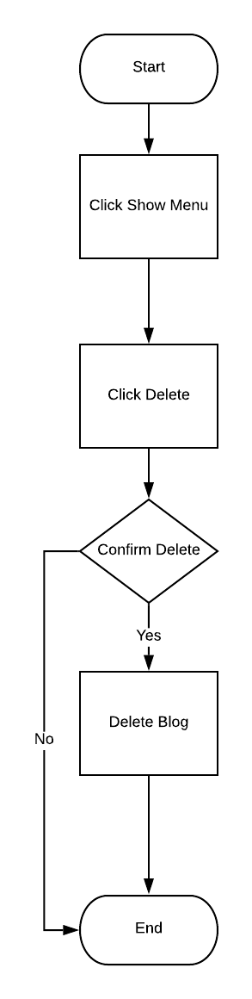

# Try Selenium webdriver

## Set up
```
npm install

node test.js
```

## Blog Project
- [Blog By Thong](https://github.com/rawipas2/blog)

## Test path

### Post Blog

- Diagram:

<p align="center">
  
</p>

- UI:


___


- Code:
```javascript
async function SumbitBlog() {
    const driver = await new Builder()
    .forBrowser('chrome')
    .build();
    try {
        await driver.get('http://localhost:8080/')
        await driver.findElement(By.id('input-13')).sendKeys('Post Test')
        await driver.findElement(By.id('input-16')).sendKeys('This is a long content')
        await driver.findElement(By.id('submit')).click()
        await driver.findElement(By.id('Blog')).click()
        await driver.wait(until.urlContains('listblog', 1000))
    }
    catch (err) {
        console.log(err)
        await driver.quit()
    }
    finally {
        await driver.quit()
    }

}

async function ResetField() {
    const driver = await new Builder()
    .forBrowser('chrome')
    .build();
    try {
        let TitleField = driver.findElement(By.id('input-13'))
        let BodyField = driver.findElement(By.id('input-16'))
        await driver.get('http://localhost:8080/')
        await TitleField.sendKeys('Post Test')
        await BodyField.sendKeys('This is a long content')
        await driver.findElement(By.id('reset')).click()
        await driver.wait(until.elementTextIs(TitleField, ''), 1000)
        await driver.wait(until.elementTextIs(BodyField, ''), 1000)

    }
    catch (err) {
        console.log(err)
        await driver.quit()
    }
    finally {
        await driver.quit()
    }
}
```

### Edit Blog:

- Diaagram:

<p align="center">
  
</p>

- UI:


___


- Code:
```javascript
async function editDescription(bid){
    const driver = await new Builder()
    .forBrowser('chrome')
    .build();
    try {
        const blogID = bid || '5edcb6b56f799821a2bf6b27'
        const body = driver.findElement(By.id(`body-${blogID}`))
        await driver.get('http://localhost:8080/listblog')
        await driver.findElement(By.id('menu')).click()
        await driver.wait(until.elementLocated(By.id('input-20')), 2000)
        await driver.findElement(By.id('input-20')).sendKeys('This is new Long Content')//Change input-??? following blog
        await driver.findElement(By.id(`save-${blogID}`)).click()
        await driver.wait(until.elementTextIs(body, 'This is new Long Content'), 2000)

    }
    catch (err) {
        console.log(err)
        await driver.quit()
    }
    finally {
        await driver.quit()
    }
}
```

### Delete Blog:

- Diagram

<p align="center">
  
</p>

- UI:


- Code:
```javascript
async function deleteBlog(bid){
    const driver = await new Builder()
    .forBrowser('chrome')
    .build();
    try {
        const blogID = bid || '5edcb6b56f799821a2bf6b27'
        await driver.get('http://localhost:8080/listblog')
        await driver.findElement(By.id('menu')).click()
        await driver.wait(until.elementLocated(By.id(`delete-${blogID}`)), 2000)
        await driver.findElement(By.id(`delete-${blogID}`)).click()
        await driver.wait(until.elementTextIs(body, 'This is new Long Content'), 2000)

    }
    catch (err) {
        console.log(err)
        await driver.quit()
    }
    finally {
        await driver.quit()
    }
}
```


___  
