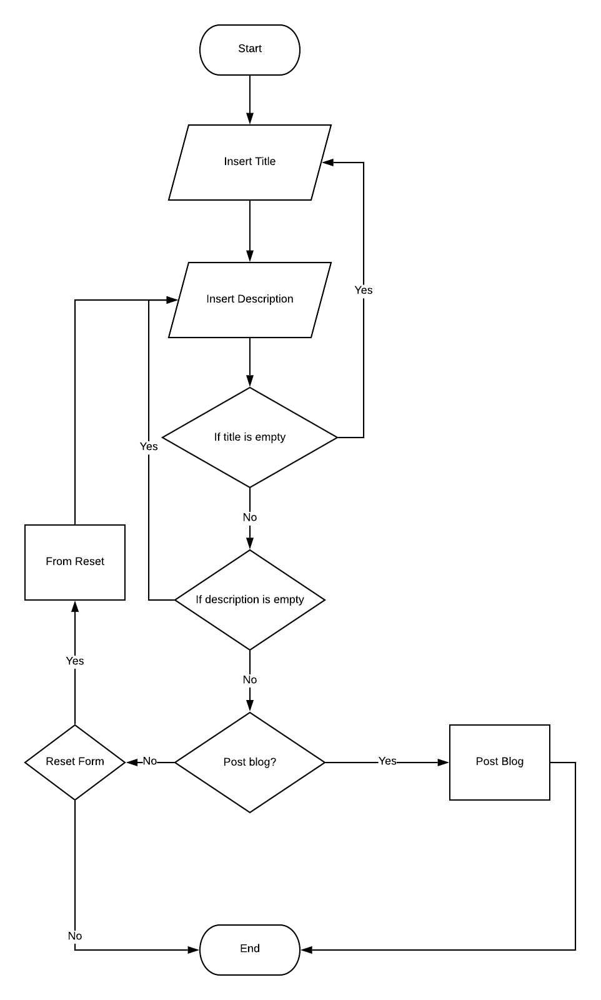
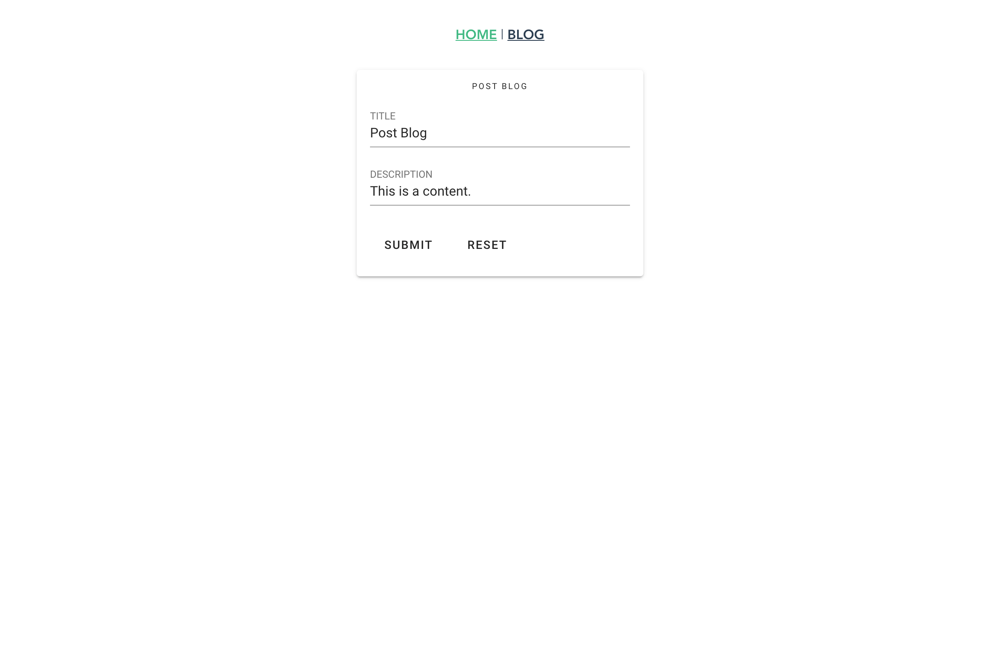
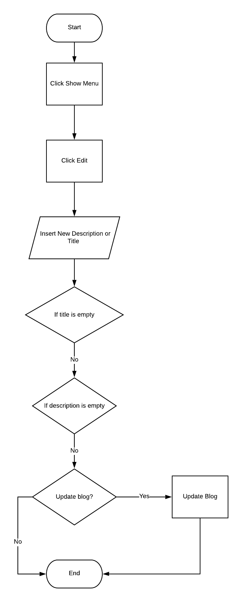
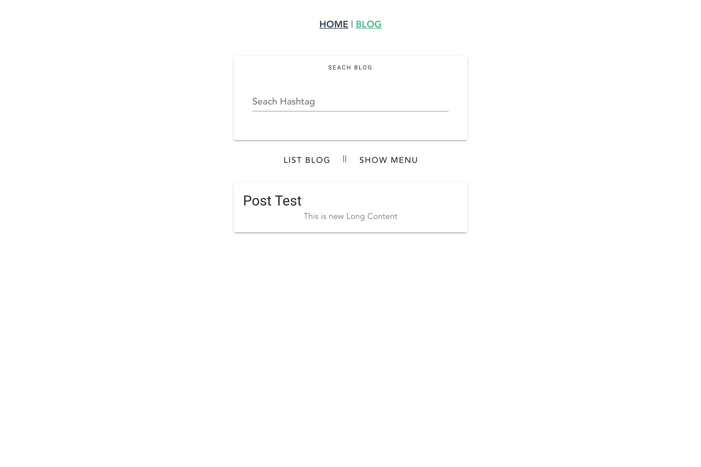
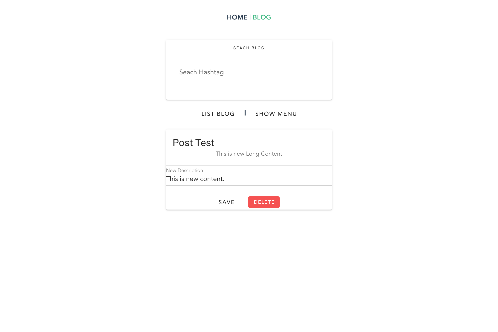

# Try Selenium webdriver

## Set up
```
npm install

node test.js
```

## Blog Project
- [Blog By Thong](https://github.com/rawipas2/blog)

## Test path

### Post Blog

- Diagram:

<p align="center">
  
</p>

- UI:




### Edit Blog:

- Diaagram:

<p align="center">
  
</p>

- UI:





